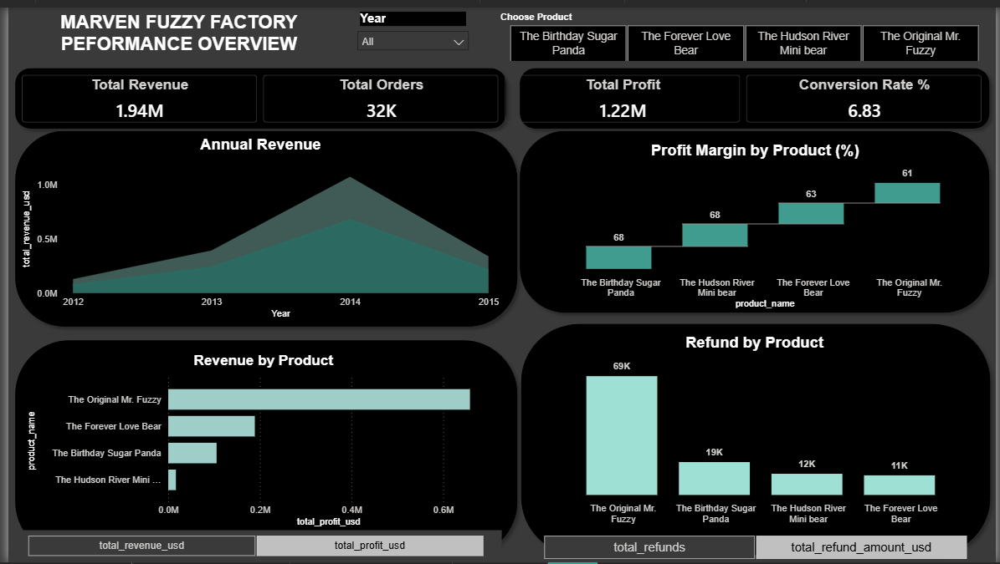
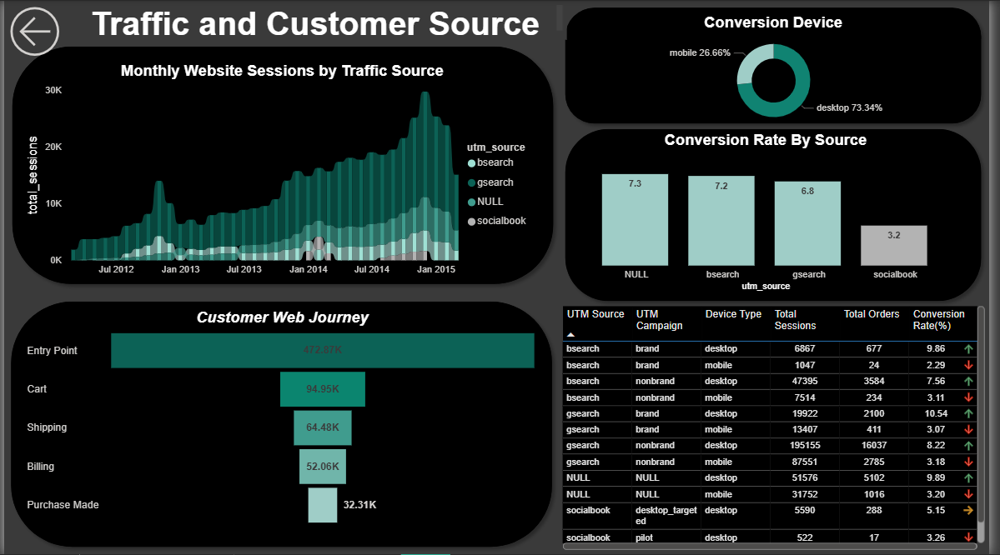
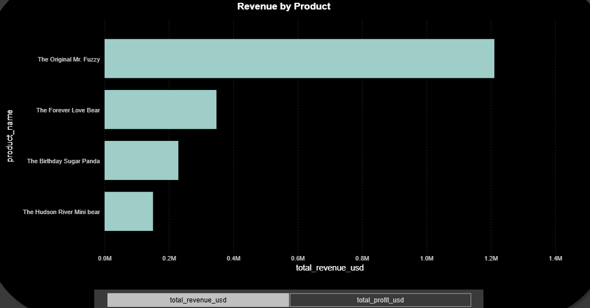
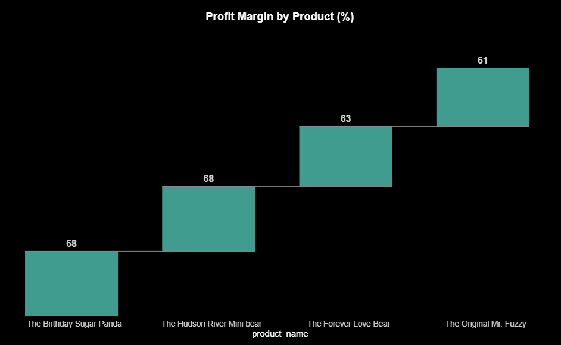
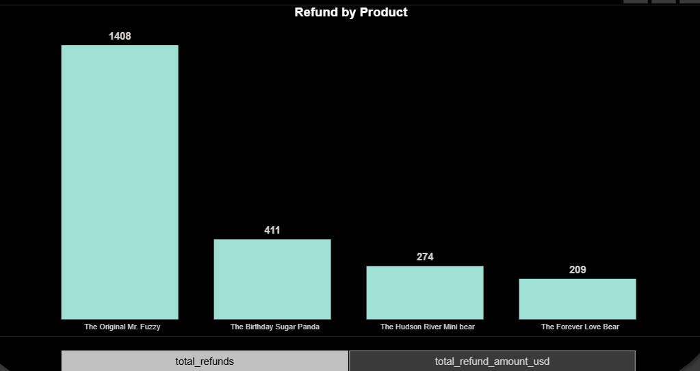
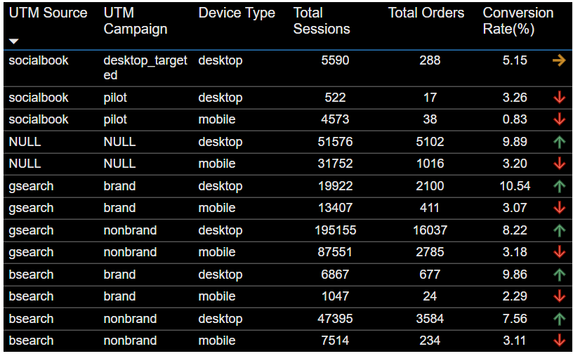
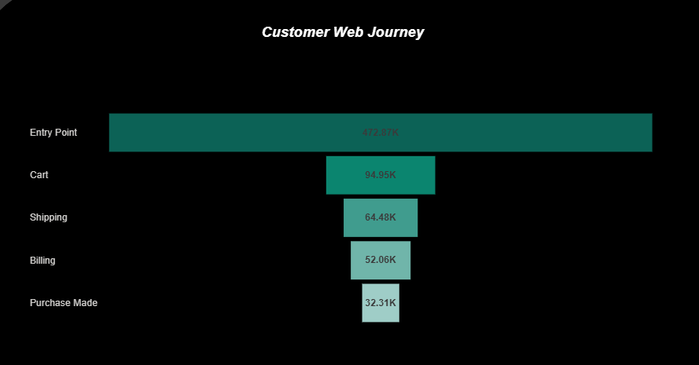

# 🧸 Marven Fuzzy Factory — Product and Performance Analysis


## 📌 Project Overview

This project analyses the Marven Fuzzy Factory e-commerce dataset to uncover the key drivers behind the company's revenue growth and decline between 2012 and 2015. The analysis was approached from a **product analyst perspective**, focusing not just on the numbers, but on *what the numbers mean* for the business.

The final deliverable is a two-page interactive Power BI dashboard designed for executive and board-level stakeholders.

📥 **[Download Power BI Dashboard File](https://github.com/mercymusonda/Marven-Fuzzy-Factory-Product-Analysis/blob/main/Marven_Ecommerce_Dashboard.pbix)**


**HOW TO USE:** Download `Power BI Desktop` and open the file to interact with the Dashboards.


### Page 1 — Performance Overview
 


### Page 2 — Traffic and Customer Source
 


## 🎯  Questions Answered

- What does the company's annual revenue, cost and profit trend look like?
- Which products drive the most revenue, and which are most profitable?
- Why did revenue drop dramatically in 2015 despite strong growth in prior years?
- Which products are being refunded the most, and when did this start?
- Where are customers coming from and which campaigns convert best?
- Where in the purchase journey are customers dropping off?


## 🛠️ Tools Used


**SQL (PostgreSQL):** for data extraction, transformation and analysis 

**pgAdmin 4:** SQL query execution and database management  

**Power BI:** Dashboard designing and data visualisation 

**DAX:** Calculated measures and KPI formulas 

**Power Query:** Data cleaning and date table creation 


## 🗂️ Dataset and Schema

The dataset is sourced from the **Maven Analytics** learning platform. It represents a fictional e-commerce toy brand `Marvyn Fuzzy Factory` and contains transactional, product and web session data.

### Tables


1. orders              
2. order_items         
3. order_item_refunds  
4. products           
5. website_sessions  
6. website_page_views  


### Key Relationships

```
website_sessions ──► orders ──► order_items ──► order_item_refunds
                                     │
                                  products
                                     │
                          website_page_views
```


## 🔍 SQL Queries

### 1. Annual Financial Performance

```sql
-- To analyse the annual financial performance of Marven Fuzzy Factory across all available years
-- To track the growth and decline of revenue, costs and profit over time
-- To calculate profit margin percentage and assess pricing and cost efficiency year on year


SELECT
    EXTRACT(YEAR FROM created_at) AS year,
    COUNT(order_id) AS total_orders,
    SUM(price_usd) AS total_revenue,
    SUM(cogs_usd) AS total_costs,
    SUM(price_usd - cogs_usd) AS total_profit,
    ROUND((SUM(price_usd - cogs_usd) / SUM(price_usd)) * 100, 2) AS profit_margin_percentage
FROM orders
GROUP BY year
ORDER BY year;
```


### 2. Product Performance

```sql
-- To evaluate the performance of each individual product within the Marven's catalogue
-- To compare revenue, cost and profit across all products and identify the strongest and weakest performers
-- To calculate profit margin percentage per product and assess which products are most efficient and profitable


SELECT 
    p.product_name,
    COUNT(oi.order_item_id) AS total_units_sold,
    SUM(oi.price_usd) AS total_revenue,
    SUM(oi.cogs_usd) AS total_cost,
    SUM(oi.price_usd - oi.cogs_usd) AS total_profit,
    ROUND(SUM(oi.price_usd - oi.cogs_usd) / SUM(oi.price_usd),2) * 100 AS profit_margin_percentage
FROM order_items oi
LEFT JOIN products p 
    ON oi.order_product_id = p.product_id
GROUP BY p.product_name
ORDER BY total_revenue DESC;
```


### 3. Refunds by Product and Year

```sql
-- To identify which products are being refunded the most and track refund trends across each year
-- To assess the financial impact of refunds on each product by measuring total refund amounts annually

SELECT 
    EXTRACT(YEAR FROM r.created_at) AS refund_year,
    p.product_name,
    COUNT(r.order_item_refund_id) AS total_refunds,
    SUM(r.refund_amount_usd) AS total_refund_amount
FROM order_item_refunds r
LEFT JOIN order_items oi 
    ON r.order_item_id = oi.order_item_id
LEFT JOIN products p 
    ON oi.order_product_id = p.product_id
GROUP BY refund_year, p.product_name
ORDER BY refund_year, total_refunds DESC;
```


### 4. Traffic Source Conversion Rate

```sql
-- To identify which traffic sources and marketing campaigns are driving the most sessions and orders to the Marven Fuzzy Factory website
-- To measure the conversion rate of each campaign and determine which channels are most effective at turning visitors into buyers
-- To highlight underperforming campaigns with low conversion rates that may require review or reallocation of marketing budget

SELECT 
    ws.utm_source,
    ws.utm_campaign,
    COUNT(DISTINCT ws.website_session_id) AS total_sessions,
    COUNT(DISTINCT o.order_id) AS total_orders,
    ROUND(COUNT(DISTINCT o.order_id) * 100.0 / 
    COUNT(DISTINCT ws.website_session_id), 2) AS conversion_rate
FROM website_sessions ws
LEFT JOIN orders o 
    ON ws.website_session_id = o.website_session_id
GROUP BY ws.utm_source, ws.utm_campaign
ORDER BY total_sessions DESC;
```


### 5. Traffic Source, Campaign and Device Breakdown

```sql
-- To analyse website traffic and conversion performance broken down by source, campaign and device type
-- To identify which combination of traffic source, campaign and device drives the highest sessions and orders
-- To evaluate how device type influences purchasing behaviour across different traffic sources and campaigns

SELECT
    ws.utm_source,
    ws.utm_campaign,
    ws.device_type,
    COUNT(DISTINCT ws.website_session_id) AS total_sessions,
    COUNT(DISTINCT o.order_id) AS total_orders,
    ROUND(COUNT(DISTINCT o.order_id) * 100.0 /
    COUNT(DISTINCT ws.website_session_id), 2) AS conversion_rate
FROM website_sessions ws
LEFT JOIN orders o
    ON ws.website_session_id = o.website_session_id
GROUP BY ws.utm_source, ws.utm_campaign, ws.device_type
ORDER BY total_sessions DESC;
```


### 6. Monthly Sessions by Traffic Source

```sql
-- To analyse monthly website traffic trends broken down by each traffic source
-- To identify which sources consistently drive the most sessions over time and detect seasonal patterns
-- To support marketing budget decisions by highlighting which sources grow, decline or remain stable month on month

SELECT
    DATE_TRUNC('month', created_at) AS month,
    utm_source,
    COUNT(DISTINCT website_session_id) AS total_sessions
FROM website_sessions
GROUP BY month, utm_source
ORDER BY month, total_sessions DESC;
```


### 7. Website Page Views

```sql
-- To identify the most visited pages on the Marven Fuzz Factory website
-- and understand customer navigation behaviour and drop off points


SELECT
    pageview_url,
    COUNT(DISTINCT website_session_id) AS total_sessions
FROM
    website_pageviews
GROUP BY
    pageview_url
ORDER BY
    total_sessions DESC;
```


### 8. Customer Purchase Journey Funnel

```sql
-- To map the complete customer purchase journey across all stages of the Marven Fuzzy Factory website funnel
-- To measure how many sessions progress through each stage from entry point to completed purchase
-- To identify which stage experiences the highest drop off and represents the biggest opportunity for improvement


WITH entry AS (
    SELECT DISTINCT website_session_id
    FROM website_pageviews
    WHERE pageview_url IN (
        '/home', '/lander-1', '/lander-2',
        '/lander-3', '/lander-4', '/lander-5',
        '/products', '/the-original-mr-fuzzy',
        '/the-forever-love-bear', '/the-birthday-sugar-panda',
        '/the-hudson-river-mini-bear'
    )
),
cart     AS (
    SELECT DISTINCT 
    website_session_id 
    FROM website_pageviews 
    WHERE pageview_url = '/cart'),

shipping AS (
    SELECT DISTINCT
     website_session_id 
     FROM website_pageviews
    WHERE pageview_url = '/shipping'),

billing  AS (
    SELECT DISTINCT w
    ebsite_session_id 
    FROM website_pageviews 
    WHERE pageview_url IN ('/billing', '/billing-2')),

thank_you AS (
    SELECT DISTINCT 
    website_session_id
     FROM website_pageviews 
     WHERE pageview_url = '/thank-you-for-your-order')

SELECT 
'Entry Point'  AS stage, 
COUNT(*) AS total 
FROM entry

UNION ALL
SELECT 'Cart'  AS stage, 
COUNT(*) AS total 
FROM cart

UNION ALL
SELECT 'Shipping'  AS stage,
 COUNT(*) AS total 
 FROM shipping

UNION ALL
SELECT 'Billing'  AS stage, 
COUNT(*) AS total 
FROM billing

UNION ALL
SELECT 'Completed Purchase' AS stage, 
COUNT(*) AS total 
FROM thank_you;
```

---

## 📊 DAX Measures

All measures were stored in a dedicated **Measure table** in Power BI for clean organisation.

```dax
total_revenue_usd = SUM(order_items[price_usd])

total_cost_usd = SUM(orders[cogs_usd])

total_profit_usd = [total_revenue_usd] - [total_cost_usd]

profit_margin_pct = ROUND(DIVIDE([total_profit_usd], [total_revenue_usd]) * 100, 2)

total_orders = COUNT(orders[order_id])

total_refunds = COUNT(order_item_refunds[order_item_refund_id])

total_refund_amount_usd = SUM(order_item_refunds[refund_amount_usd])

conversion_rate_pct = DIVIDE(
    DISTINCTCOUNT(orders[website_session_id]), 
    DISTINCTCOUNT(website_sessions[website_session_id]),
    0)
     * 100
```

### Date Table

```dax
date_table = ADDCOLUMNS(
    CALENDARAUTO(),
    "Year", YEAR([Date]),
    "Month_number", MONTH([Date]),
    "Month_name", FORMAT([Date], "MMMM")
)
```


## 📈 Key Findings

### Part 1 — Annual Financial Trend

.png)

An analysis of Marven Fuzzy Factory's annual performance was conducted using data available from 2012 to 2015. Note that the dataset begins in 2012 and does not reflect the company's full history and all conclusions are limited to this period.

| Year | Total Orders | Total Revenue | Total Cost | Total Profit | Profit Margin |
|------|-------------|---------------|------------|--------------|---------------|
| 2012 | 2,586 | $129,274 | $50,401 | $78,873 | 61.0% |
| 2013 | 7,447 | $393,248 | $151,651 | $241,597 | 61.4% |
| 2014 | 16,860 | $1,075,612 | $395,890 | $679,723 | 63.2% |
| 2015 | 5,420 | $340,376 | $124,428 | $215,948 | 63.4% |

- From 2012 to 2014 the business showed consistent growth in revenue, cost and profit, peaking in 2014 as the strongest performing year on record within this dataset.
- In 2015 orders dropped by **68%**  from 16,860 to just 5,420, representing a sharp decline from the 2014 peak.
- Despite the revenue drop, **profit margin remained consistent at approximately 63%** across all years, suggesting the business naturally scaled costs down in line with reduced sales volume rather than overspending to compensate.
- While margin consistency is a sign of lean cost discipline, the absolute profit fell by over **$463,000** in real terms, highlighting that margin alone cannot mask the impact of lost sales volume.

---

### Part 2 — Product Performance



The business carries only **4 products.** Mr. Fuzzy is the dominant product across all metrics with highest units sold, highest total revenue, highest total cost and highest total profit. The remaining three products follow a consistent ranking pattern across all the same metrics.

  ###   Margin By Product


However Mr. Fuzzy carries the **lowest profit margin** of all four products despite its dominance in volume. The smaller products, while lower in total revenue, retain more profit per dollar earned — reflecting a classic **volume vs efficiency tradeoff.**

---

### Part 3 — Refund Analysis



Mr. Fuzzy recorded the highest refund count by a significant margin, with a gap of nearly **1,000 units** separating it from the second most refunded product. This is a serious product quality signal.

A concentrated spike of **213 refunds was recorded in September 2014.** Although refunds declined after that point, the damage to customer confidence had already occurred — resulting in the sharp order volume drop seen in 2015.

 *"As the brand's namesake product, Mr. Fuzzy carries significant reputational weight for Marven Fuzzy Factory. The September 2014 refund spike therefore not only impacted revenue but potentially damaged the core brand identity, making the recovery of Mr. Fuzzy's quality and customer satisfaction a strategic priority."*

---

### Part 4 — Traffic and Marketing


Overall the website converts well above the industry average of 2–4%.

- **Brand campaigns** perform the strongest of converting at up to **10.54%** on desktop. Customers searching specifically for the brand arrive with high buying intent.
- **Desktop converts significantly better than mobile** across all sources — 73.34% of conversions come from desktop users.
- **Socialbook's pilot campaign** is significantly underperforming at just **3.26%**, the lowest converting campaign and a candidate for budget review or discontinuation.


### Part 5 — Customer Web Journey

 

The biggest drop off point is between **Entry Point and Cart** — where approximately **378,000 sessions** browse but never add to cart. A secondary drop occurs between Cart and Shipping where roughly **30,000 sessions** abandon at checkout.


## 💡 Business Recommendations

1. **Investigate Mr. Fuzzy product quality:** 
The September 2014 refund spike suggests a quality or expectation issue. A product review and improved product descriptions could reduce the refund rate and rebuild customer trust.

2. **Review the pilot campaign on Socialbook:**  At 3.26% conversion it is significantly underperforming all other channels. Budget should be reallocated to brand campaigns on gsearch and bsearch which convert at over 9%.

3. **Improve mobile experience:** Mobile accounts for only 26.66% of conversions despite likely representing a significant share of traffic. Optimising the mobile checkout experience could recover meaningful revenue.

4. **Address cart abandonment:**  Approximately 378,000 sessions never make it to cart. Cart abandonment emails, checkout simplification and trust signals at the billing stage could improve conversion.

5. **Increase visibility of Hudson River Mini Bear:**  With only 2,610 page views compared to 162,525 for Mr. Fuzzy, this product is practically invisible. Featuring it more prominently or bundling it with Mr. Fuzzy could increase its sales volume.


## 🖥️ Dashboard

The final deliverable is a two-page Power BI dashboard:

**Page 1 — Performance Overview**
KPI cards, annual revenue trend, revenue by product, profit margin by product and refunds by product — with year and product filters.
### Page 1 — Performance Overview
 


**Page 2 — Traffic and Customer Source**
Monthly sessions by traffic source, conversion by device, conversion rate by source, customer web journey funnel and a detailed campaign breakdown table.
### Page 2 — Traffic and Customer Source
 

> 📸 *Screenshots of the dashboard are included in the `/images` folder of this repository.*


## 🧠 What I Learned

- How to approach a dataset from a **product analyst perspective**  asking why, not just what
- How to connect multiple relational tables using SQL **JOINs** to build meaningful analysis
- The importance of **not making assumptions beyond the data**, only stating what the data actually shows
- How to build a **Date Table in DAX** and connect it to multiple fact tables for proper time filtering in Power BI
- How to identify a **root cause** by drilling from high-level trends down to product and time-level detail
- How to translate raw numbers into **board-ready business recommendations**
- The difference between **profit margin consistency** and actual profitability and why both matter


## 👤 Author

**[Your Name]**
Aspiring Data / Product Analyst
📧 mmusonda395@gmail.com


> *This project was completed as part of my data analytics portfolio using the Maven Analytics Marvyn Fuzzy Factory dataset.*
